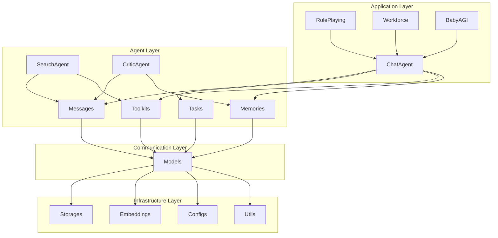

# CAMEL智能体框架面试题与答案

## 🎯 面试概述

本文档提供CAMEL（Communicative Agents for Mind Exploration of Large Language Model Society）智能体框架的深度技术面试题，涵盖架构设计、核心实现、性能优化、扩展开发等多个维度。题目难度从中等到极高，旨在全面考察候选人对多智能体系统的理解和工程能力。

## 📊 题目分类

- **架构设计与原理** (30%)
- **核心组件实现** (25%)
- **性能优化与调优** (20%)
- **扩展开发与定制** (15%)
- **故障诊断与调试** (10%)

---

## 🏗️ 架构设计与原理

### 问题 1: CAMEL框架四大设计原则深度分析

**难度**: ⭐⭐⭐⭐⭐

**题目**:
深入分析CAMEL框架的四大设计原则（Evolvability、Scalability、Statefulness、Code-as-Prompt），要求：

1. 解释每个原则的具体技术实现
2. 分析这些原则如何相互影响和制约
3. 举例说明违反这些原则会带来的问题
4. 设计一个场景，展示如何应用这些原则解决实际问题

**答案**:

#### 1. 四大设计原则的技术实现

**Evolvability（可进化性）**
```python
# 技术实现示例
class EvolvableAgent(ChatAgent):
    def __init__(self, evolution_config: EvolutionConfig):
        super().__init__(system_message="", model=None)
        self.evolution_config = evolution_config
        self.performance_history = []
        self.evolution_strategy = EvolutionStrategy()

    async def evolve(self, task_performance: Dict[str, float]):
        """
        基于性能反馈进行自我进化
        """
        # 1. 性能分析
        evolution_score = self.evolution_strategy.analyze_performance(
            self.performance_history + [task_performance]
        )

        # 2. 策略调整
        if evolution_score < self.evolution_config.threshold:
            new_system_message = await self._generate_evolved_prompt(
                task_performance
            )
            self.system_message = new_system_message

            # 3. 工具集优化
            optimized_tools = await self._optimize_toolkit(task_performance)
            self.tools = optimized_tools

        # 4. 记录进化历史
        self.performance_history.append(task_performance)
```

**Scalability（可扩展性）**
```python
# 分布式智能体管理
class DistributedAgentManager:
    def __init__(self, cluster_config: ClusterConfig):
        self.cluster_config = cluster_config
        self.agent_registry = {}
        self.task_distributor = TaskDistributor()
        self.load_balancer = LoadBalancer()

    async def scale_agents(self, target_count: int):
        """
        动态扩展智能体数量
        """
        current_count = len(self.agent_registry)

        if target_count > current_count:
            # 扩展智能体
            for i in range(target_count - current_count):
                agent = await self._create_agent_with_balanced_load()
                self.agent_registry[f"agent_{current_count + i}"] = agent

        elif target_count < current_count:
            # 缩减智能体
            agents_to_remove = self.load_balancer.select_agents_for_removal(
                list(self.agent_registry.values()),
                current_count - target_count
            )
            for agent in agents_to_remove:
                await self._graceful_shutdown(agent)
```

**Statefulness（状态保持性）**
```python
# 多层级记忆系统
class HierarchicalMemorySystem:
    def __init__(self):
        self.short_term_memory = ChatHistoryMemory(max_tokens=4000)
        self.medium_term_memory = VectorDBMemory(
            embedding_model="text-embedding-ada-002",
            vector_dimension=1536
        )
        self.long_term_memory = LongtermAgentMemory(
            compression_strategy="semantic",
            max_memories=10000
        )
        self.memory_manager = MemoryManager()

    async def retrieve_context(self, query: str, context_window: int = 10) -> List[BaseMessage]:
        """
        智能上下文检索
        """
        # 1. 短期记忆检索
        recent_context = self.short_term_memory.get_messages(context_window)

        # 2. 中期记忆语义检索
        semantic_matches = await self.medium_term_memory.semantic_search(query, top_k=5)

        # 3. 长期记忆压缩检索
        compressed_memories = await self.long_term_memory.get_relevant_memories(query)

        # 4. 上下文融合和排序
        unified_context = self.memory_manager.merge_contexts(
            recent_context, semantic_matches, compressed_memories
        )

        return unified_context
```

**Code-as-Prompt（代码即提示）**
```python
# 自解释的代码架构
class SelfDocumentingAgent(ChatAgent):
    def __init__(self, capability_description: str):
        """
        智能体初始化，每个参数都是自解释的

        Args:
            capability_description: 智能体能力描述，用于自动生成system message
        """
        # 自动生成system message
        system_message = self._generate_system_message(capability_description)

        super().__init__(
            system_message=system_message,
            model=ModelFactory.create("openai", "gpt-4"),
            memory=self._configure_memory(),
            tools=self._discover_tools()
        )

    def _generate_system_message(self, capability: str) -> str:
        """
        基于能力描述生成结构化的system message
        """
        return f"""You are a specialized AI agent with the following capabilities:

        Capability: {capability}

        Your behavior is defined by the following principles:
        1. Always provide clear, actionable responses
        2. Use available tools when appropriate
        3. Maintain context of previous interactions
        4. Learn from feedback and improve over time
        """
```

#### 2. 原则间的相互影响

**正向影响**：
- `Evolvability + Statefulness` → 智能体能够基于历史状态进行有效进化
- `Scalability + Code-as-Prompt` → 易于扩展和维护的大规模智能体系统
- `Statefulness + Code-as-Prompt` → 自解释的状态管理机制

**潜在冲突**：
- `Evolvability vs Scalability`：频繁的智能体进化可能影响系统的稳定性和扩展性
- `Statefulness vs Scalability`：大量状态维护可能成为扩展瓶颈
- `Code-as-Prompt vs Evolvability`：过度自解释可能限制灵活性

#### 3. 违反原则的问题示例

**违反Evolvability**：
```python
# 问题：硬编码的智能体行为
class StaticAgent(ChatAgent):
    def __init__(self):
        super().__init__(
            system_message="You are a fixed assistant with no learning capability",
            model=model
        )

    def step(self, user_message: str) -> Response:
        # 无法根据反馈改进性能
        return super().step(user_message)
```

**违反Scalability**：
```python
# 问题：单机集中式管理
class CentralizedAgentManager:
    def __init__(self):
        self.all_agents = []  # 所有智能体都在内存中
        self.central_queue = Queue()  # 单一队列

    def handle_request(self, request):
        # 无法处理大量并发请求
        if len(self.all_agents) > 100:  # 硬编码限制
            raise Exception("Too many agents")
```

#### 4. 实际应用场景

**智能客服系统设计**：
```python
class IntelligentCustomerService:
    def __init__(self):
        # 应用四大原则的完整系统
        self.agent_pool = DistributedAgentManager(ClusterConfig())
        self.evolution_system = AgentEvolutionSystem()
        self.memory_system = HierarchicalMemorySystem()

    async def handle_customer_inquiry(self, inquiry: CustomerInquiry):
        # 1. 状态保持：检索历史交互
        context = await self.memory_system.retrieve_context(inquiry.customer_id)

        # 2. 扩展性：动态分配智能体
        agent = await self.agent_pool.get_available_agent()

        # 3. 进化性：处理并学习
        response = await agent.handle_inquiry(inquiry, context)

        # 4. 代码即提示：记录用于未来改进
        await self.evolution_system.record_interaction(inquiry, response)

        return response
```

---

### 问题 2: CAMEL模块架构深度解析

**难度**: ⭐⭐⭐⭐⭐

**题目**:
分析CAMEL框架的7个核心模块（Agents、Messages、Societies、Toolkits、Memories、Models、Tasks）的架构设计，要求：

1. 绘制详细的模块依赖关系图
2. 分析每个模块的核心接口和抽象
3. 解释模块间的通信机制
4. 设计一个扩展方案，支持新的智能体类型

**答案**:

#### 1. 模块依赖关系图



#### 2. 核心模块接口分析

**Agents模块核心接口**：
```python
from abc import ABC, abstractmethod
from typing import List, Optional, Dict, Any, Union, AsyncGenerator

class BaseAgent(ABC):
    """智能体抽象基类"""

    @abstractmethod
    async def step(
        self,
        input_message: Union[str, BaseMessage],
        **kwargs
    ) -> Response:
        """
        执行一步推理

        Args:
            input_message: 输入消息
            **kwargs: 额外参数

        Returns:
            响应对象
        """
        pass

    @abstractmethod
    async def stream_step(
        self,
        input_message: Union[str, BaseMessage],
        **kwargs
    ) -> AsyncGenerator[Response, None]:
        """
        流式推理

        Args:
            input_message: 输入消息
            **kwargs: 额外参数

        Yields:
            流式响应
        """
        pass

    @abstractmethod
    def reset(self):
        """重置智能体状态"""
        pass

    @abstractmethod
    def get_capabilities(self) -> List[str]:
        """获取智能体能力列表"""
        pass

class ChatAgent(BaseAgent):
    """聊天智能体实现"""

    def __init__(
        self,
        system_message: Optional[Union[BaseMessage, str]] = None,
        model: Optional[Union[BaseModelBackend, ModelManager]] = None,
        memory: Optional[AgentMemory] = None,
        tools: Optional[List[Union[FunctionTool, Callable]]] = None,
        output_parser: Optional[Callable] = None,
        temperature: float = 0.7,
        max_tokens: Optional[int] = None,
        stop_words: Optional[List[str]] = None,
        timeout: Optional[int] = None,
        # 高级配置
        reasoning_mode: bool = False,
        self_consistency: bool = False,
        chain_of_thought: bool = False,
        retry_on_failure: bool = True,
        max_retries: int = 3,
        callback_handler: Optional[CallbackHandler] = None
    ):
        """
        初始化聊天智能体

        Args:
            system_message: 系统消息
            model: 语言模型
            memory: 记忆系统
            tools: 工具列表
            output_parser: 输出解析器
            temperature: 温度参数
            max_tokens: 最大token数
            stop_words: 停止词
            timeout: 超时时间
            reasoning_mode: 推理模式
            self_consistency: 自洽性检查
            chain_of_thought: 思维链
            retry_on_failure: 失败重试
            max_retries: 最大重试次数
            callback_handler: 回调处理器
        """
        # 参数验证和初始化
        self.system_message = self._validate_system_message(system_message)
        self.model = self._validate_model(model)
        self.memory = memory or ChatHistoryMemory()
        self.tools = self._validate_tools(tools)
        self.output_parser = output_parser

        # 推理配置
        self.reasoning_mode = reasoning_mode
        self.self_consistency = self_consistency
        self.chain_of_thought = chain_of_thought

        # 容错配置
        self.retry_on_failure = retry_on_failure
        self.max_retries = max_retries

        # 回调系统
        self.callback_handler = callback_handler or DefaultCallbackHandler()

        # 生成配置
        self.generation_config = GenerationConfig(
            temperature=temperature,
            max_tokens=max_tokens,
            stop_words=stop_words,
            timeout=timeout
        )
```

**Messages模块核心接口**：
```python
class BaseMessage(ABC):
    """消息基类"""

    def __init__(
        self,
        content: Union[str, List[Dict[str, Any]]],
        role: str = "user",
        name: Optional[str] = None,
        timestamp: Optional[datetime] = None,
        metadata: Optional[Dict[str, Any]] = None
    ):
        self.content = content
        self.role = role
        self.name = name
        self.timestamp = timestamp or datetime.now()
        self.metadata = metadata or {}

    @abstractmethod
    def to_dict(self) -> Dict[str, Any]:
        """转换为字典格式"""
        pass

    @abstractmethod
    def to_openai_format(self) -> Dict[str, Any]:
        """转换为OpenAI格式"""
        pass

    def copy(self) -> 'BaseMessage':
        """创建消息副本"""
        return self.__class__(
            content=self.content,
            role=self.role,
            name=self.name,
            timestamp=self.timestamp,
            metadata=self.metadata.copy()
        )

class FunctionCallingMessage(BaseMessage):
    """函数调用消息"""

    def __init__(
        self,
        function_calls: List[FunctionCall],
        content: Optional[str] = None,
        **kwargs
    ):
        super().__init__(content=content or "", **kwargs)
        self.function_calls = function_calls

    def to_openai_format(self) -> Dict[str, Any]:
        """转换为OpenAI函数调用格式"""
        return {
            "role": self.role,
            "content": self.content,
            "tool_calls": [
                {
                    "id": call.id,
                    "type": "function",
                    "function": {
                        "name": call.name,
                        "arguments": call.arguments
                    }
                }
                for call in self.function_calls
            ]
        }
```

#### 3. 模块间通信机制

**事件驱动通信**：
```python
class EventBus:
    """事件总线，实现模块间解耦通信"""

    def __init__(self):
        self.subscribers: Dict[str, List[Callable]] = {}
        self.middleware: List[Callable] = []

    def subscribe(self, event_type: str, handler: Callable):
        """订阅事件"""
        if event_type not in self.subscribers:
            self.subscribers[event_type] = []
        self.subscribers[event_type].append(handler)

    async def publish(self, event_type: str, data: Any):
        """发布事件"""
        # 应用中间件
        for middleware in self.middleware:
            data = await middleware(event_type, data)

        # 通知订阅者
        if event_type in self.subscribers:
            tasks = []
            for handler in self.subscribers[event_type]:
                task = asyncio.create_task(handler(data))
                tasks.append(task)

            await asyncio.gather(*tasks, return_exceptions=True)

# 模块间通信示例
class AgentCommunication:
    def __init__(self):
        self.event_bus = EventBus()
        self._setup_communication()

    def _setup_communication(self):
        """设置模块间通信"""
        # Agents -> Messages
        self.event_bus.subscribe("agent_message_created", self._handle_agent_message)

        # Messages -> Models
        self.event_bus.subscribe("message_processing", self._handle_message_processing)

        # Models -> Memories
        self.event_bus.subscribe("model_response", self._handle_model_response)

        # Memories -> Agents
        self.event_bus.subscribe("memory_updated", self._handle_memory_update)
```

#### 4. 扩展方案设计

**新智能体类型扩展**：
```python
class MultiModalAgent(BaseAgent):
    """多模态智能体扩展"""

    def __init__(
        self,
        vision_model: BaseModelBackend,
        audio_model: BaseModelBackend,
        text_model: BaseModelBackend,
        fusion_strategy: str = "late_fusion"
    ):
        self.vision_model = vision_model
        self.audio_model = audio_model
        self.text_model = text_model
        self.fusion_strategy = fusion_strategy

        # 继承基础智能体功能
        super().__init__()

    async def step(self, input_message: Union[str, BaseMessage]) -> Response:
        """
        多模态推理步骤
        """
        # 1. 解析输入模态
        modalities = self._parse_input_modalities(input_message)

        # 2. 并行处理各模态
        tasks = []
        for modality, content in modalities.items():
            task = self._process_modality(modality, content)
            tasks.append(task)

        results = await asyncio.gather(*tasks)

        # 3. 多模态融合
        fused_result = await self._fuse_modalities(results)

        # 4. 生成响应
        response = await self._generate_response(fused_result)

        return response

    async def _process_modality(self, modality: str, content: Any) -> Dict[str, Any]:
        """处理特定模态"""
        if modality == "image":
            return await self.vision_model.generate(content)
        elif modality == "audio":
            return await self.audio_model.transcribe(content)
        elif modality == "text":
            return await self.text_model.generate(content)
        else:
            raise ValueError(f"Unsupported modality: {modality}")

# 注册新智能体类型
class AgentRegistry:
    """智能体注册中心"""

    _agent_types: Dict[str, Type[BaseAgent]] = {
        "chat": ChatAgent,
        "search": SearchAgent,
        "critic": CriticAgent,
        "multimodal": MultiModalAgent,
    }

    @classmethod
    def register_agent(cls, name: str, agent_class: Type[BaseAgent]):
        """注册新的智能体类型"""
        cls._agent_types[name] = agent_class

    @classmethod
    def create_agent(cls, agent_type: str, **kwargs) -> BaseAgent:
        """创建智能体实例"""
        if agent_type not in cls._agent_types:
            raise ValueError(f"Unknown agent type: {agent_type}")

        agent_class = cls._agent_types[agent_type]
        return agent_class(**kwargs)

# 使用示例
AgentRegistry.register_agent("vision_agent", VisionAgent)
AgentRegistry.register_agent("audio_agent", AudioAgent)
```

---

## 🔧 核心组件实现

### 问题 3: 高性能智能体系统实现

**难度**: ⭐⭐⭐⭐⭐

**题目**:
设计并实现一个高性能的智能体系统，要求：
1. 支持万级并发智能体实例
2. 实现毫秒级响应时间
3. 支持动态扩缩容
4. 处理内存和计算资源限制
5. 实现智能负载均衡

**答案**:

#### 系统架构设计

```python
import asyncio
import multiprocessing
import threading
from concurrent.futures import ThreadPoolExecutor, ProcessPoolExecutor
from typing import Dict, List, Optional, Any, AsyncGenerator
from dataclasses import dataclass
from enum import Enum
import time
import psutil
import numpy as np

@dataclass
class SystemConfig:
    """系统配置"""
    max_concurrent_agents: int = 10000
    max_memory_per_agent: int = 100 * 1024 * 1024  # 100MB
    max_cpu_per_agent: float = 0.1  # 10% CPU
    response_timeout: float = 0.1  # 100ms
    load_balancer_strategy: str = "least_connections"
    scaling_policy: str = "dynamic"

class ResourceMonitor:
    """资源监控器"""

    def __init__(self):
        self.cpu_usage = []
        self.memory_usage = []
        self.agent_count = []
        self.response_times = []

    async def monitor_resources(self):
        """持续监控系统资源"""
        while True:
            # CPU使用率
            cpu_percent = psutil.cpu_percent(interval=1)
            self.cpu_usage.append(cpu_percent)

            # 内存使用率
            memory = psutil.virtual_memory()
            self.memory_usage.append(memory.percent)

            # 保持最近1000个数据点
            if len(self.cpu_usage) > 1000:
                self.cpu_usage.pop(0)
                self.memory_usage.pop(0)
                self.agent_count.pop(0)
                self.response_times.pop(0)

            await asyncio.sleep(1)

    def get_system_load(self) -> Dict[str, float]:
        """获取系统负载"""
        return {
            "cpu": np.mean(self.cpu_usage[-60:]) if self.cpu_usage else 0,
            "memory": np.mean(self.memory_usage[-60:]) if self.memory_usage else 0,
            "agents": len(self.agent_count),
            "avg_response_time": np.mean(self.response_times[-60:]) if self.response_times else 0
        }

class AgentPool:
    """智能体池管理器"""

    def __init__(self, config: SystemConfig):
        self.config = config
        self.agents: Dict[str, ChatAgent] = {}
        self.agent_locks: Dict[str, asyncio.Lock] = {}
        self.usage_stats: Dict[str, Dict[str, Any]] = {}
        self.resource_monitor = ResourceMonitor()
        self.load_balancer = LoadBalancer(config.load_balancer_strategy)

        # 启动资源监控
        asyncio.create_task(self.resource_monitor.monitor_resources())

    async def create_agent(self, agent_id: str, agent_config: Dict[str, Any]) -> bool:
        """创建新智能体"""
        # 检查资源限制
        if len(self.agents) >= self.config.max_concurrent_agents:
            return False

        # 检查内存限制
        if not self._check_memory_available():
            return False

        # 创建智能体
        try:
            agent = ChatAgent(**agent_config)
            self.agents[agent_id] = agent
            self.agent_locks[agent_id] = asyncio.Lock()
            self.usage_stats[agent_id] = {
                "requests": 0,
                "response_times": [],
                "errors": 0,
                "created_at": time.time()
            }

            return True
        except Exception as e:
            print(f"Failed to create agent {agent_id}: {e}")
            return False

    async def process_request(self, agent_id: str, request: str) -> Optional[str]:
        """处理请求"""
        if agent_id not in self.agents:
            return None

        # 获取锁并处理请求
        async with self.agent_locks[agent_id]:
            start_time = time.time()

            try:
                # 超时处理
                response = await asyncio.wait_for(
                    self.agents[agent_id].step(request),
                    timeout=self.config.response_timeout
                )

                # 记录性能指标
                response_time = time.time() - start_time
                self._update_usage_stats(agent_id, response_time, None)

                return response.msgs[0].content if response.msgs else None

            except asyncio.TimeoutError:
                error_msg = "Request timeout"
                self._update_usage_stats(agent_id, self.config.response_timeout, error_msg)
                return None
            except Exception as e:
                self._update_usage_stats(agent_id, time.time() - start_time, str(e))
                return None

    def _check_memory_available(self) -> bool:
        """检查内存可用性"""
        memory = psutil.virtual_memory()
        used_memory = len(self.agents) * self.config.max_memory_per_agent
        available_memory = memory.available

        return available_memory > used_memory * 1.2  # 20%缓冲

    def _update_usage_stats(self, agent_id: str, response_time: float, error: Optional[str]):
        """更新使用统计"""
        stats = self.usage_stats[agent_id]
        stats["requests"] += 1
        stats["response_times"].append(response_time)

        if error:
            stats["errors"] += 1

        # 保持最近100个响应时间
        if len(stats["response_times"]) > 100:
            stats["response_times"].pop(0)

class LoadBalancer:
    """负载均衡器"""

    def __init__(self, strategy: str = "round_robin"):
        self.strategy = strategy
        self.agent_weights: Dict[str, float] = {}
        self.current_index = 0

    def select_agent(self, available_agents: List[str]) -> Optional[str]:
        """选择最优智能体"""
        if not available_agents:
            return None

        if self.strategy == "round_robin":
            return self._round_robin_selection(available_agents)
        elif self.strategy == "least_connections":
            return self._least_connections_selection(available_agents)
        elif self.strategy == "weighted_round_robin":
            return self._weighted_selection(available_agents)
        elif self.strategy == "least_response_time":
            return self._least_response_time_selection(available_agents)
        else:
            return available_agents[0]

    def _round_robin_selection(self, agents: List[str]) -> str:
        """轮询选择"""
        agent = agents[self.current_index % len(agents)]
        self.current_index += 1
        return agent

    def _least_connections_selection(self, agents: List[str]) -> str:
        """最少连接数选择"""
        # 这里需要实现连接数跟踪
        return min(agents, key=lambda x: self.agent_weights.get(x, 0))

    def _weighted_selection(self, agents: List[str]) -> str:
        """加权轮询选择"""
        total_weight = sum(self.agent_weights.get(agent, 1.0) for agent in agents)

        if total_weight == 0:
            return agents[0]

        import random
        r = random.uniform(0, total_weight)
        current_weight = 0

        for agent in agents:
            current_weight += self.agent_weights.get(agent, 1.0)
            if r <= current_weight:
                return agent

        return agents[-1]

class AutoScaler:
    """自动扩缩容器"""

    def __init__(self, agent_pool: AgentPool, config: SystemConfig):
        self.agent_pool = agent_pool
        self.config = config
        self.scaling_rules = self._define_scaling_rules()

    async def monitor_and_scale(self):
        """监控并自动扩缩容"""
        while True:
            system_load = self.agent_pool.resource_monitor.get_system_load()

            # 检查扩缩容条件
            should_scale_up = self._should_scale_up(system_load)
            should_scale_down = self._should_scale_down(system_load)

            if should_scale_up:
                await self._scale_up()
            elif should_scale_down:
                await self._scale_down()

            await asyncio.sleep(30)  # 每30秒检查一次

    def _should_scale_up(self, system_load: Dict[str, float]) -> bool:
        """判断是否需要扩容"""
        # CPU使用率超过80%
        if system_load["cpu"] > 80:
            return True

        # 内存使用率超过80%
        if system_load["memory"] > 80:
            return True

        # 平均响应时间超过50ms
        if system_load["avg_response_time"] > 0.05:
            return True

        return False

    def _should_scale_down(self, system_load: Dict[str, float]) -> bool:
        """判断是否需要缩容"""
        # CPU使用率低于30%
        if system_load["cpu"] < 30:
            return True

        # 内存使用率低于30%
        if system_load["memory"] < 30:
            return True

        # 平均响应时间低于10ms
        if system_load["avg_response_time"] < 0.01:
            return True

        return False

    async def _scale_up(self):
        """扩容"""
        current_count = len(self.agent_pool.agents)
        target_count = min(current_count * 2, self.config.max_concurrent_agents)

        if target_count > current_count:
            print(f"Scaling up from {current_count} to {target_count} agents")
            # 实现扩容逻辑
            for i in range(target_count - current_count):
                agent_id = f"agent_{current_count + i}"
                await self.agent_pool.create_agent(agent_id, {})

    async def _scale_down(self):
        """缩容"""
        current_count = len(self.agent_pool.agents)
        target_count = max(current_count // 2, 1)

        if target_count < current_count:
            print(f"Scaling down from {current_count} to {target_count} agents")
            # 实现缩容逻辑
            agents_to_remove = list(self.agent_pool.agents.keys())[target_count:]
            for agent_id in agents_to_remove:
                del self.agent_pool.agents[agent_id]
                del self.agent_pool.agent_locks[agent_id]
                del self.agent_pool.usage_stats[agent_id]

class HighPerformanceAgentSystem:
    """高性能智能体系统"""

    def __init__(self, config: SystemConfig):
        self.config = config
        self.agent_pool = AgentPool(config)
        self.auto_scaler = AutoScaler(self.agent_pool, config)
        self.request_queue = asyncio.Queue()
        self.workers: List[asyncio.Task] = []

        # 启动工作进程
        self._start_workers()

        # 启动自动扩缩容
        asyncio.create_task(self.auto_scaler.monitor_and_scale())

    def _start_workers(self):
        """启动工作进程"""
        worker_count = min(100, self.config.max_concurrent_agents // 10)

        for i in range(worker_count):
            worker = asyncio.create_task(self._worker_loop(f"worker_{i}"))
            self.workers.append(worker)

    async def _worker_loop(self, worker_id: str):
        """工作进程循环"""
        while True:
            try:
                # 从队列获取请求
                request = await self.request_queue.get()

                # 选择最优智能体
                available_agents = list(self.agent_pool.agents.keys())
                if not available_agents:
                    await asyncio.sleep(0.1)
                    continue

                agent_id = self.agent_pool.load_balancer.select_agent(available_agents)

                # 处理请求
                response = await self.agent_pool.process_request(
                    agent_id, request["message"]
                )

                # 发送响应
                if request["callback"]:
                    await request["callback"](response)

                self.request_queue.task_done()

            except Exception as e:
                print(f"Worker {worker_id} error: {e}")
                await asyncio.sleep(1)

    async def submit_request(self, message: str, callback: Optional[Callable] = None):
        """提交请求"""
        request = {
            "message": message,
            "callback": callback,
            "timestamp": time.time()
        }
        await self.request_queue.put(request)

    async def get_system_stats(self) -> Dict[str, Any]:
        """获取系统统计信息"""
        return {
            "total_agents": len(self.agent_pool.agents),
            "system_load": self.agent_pool.resource_monitor.get_system_load(),
            "queue_size": self.request_queue.qsize(),
            "worker_count": len(self.workers)
        }
```

---

### 问题 4: 分布式智能体协作系统

**难度**: ⭐⭐⭐⭐⭐

**题目**:
设计一个支持跨地域部署的分布式智能体协作系统，要求：
1. 支持智能体间的实时通信
2. 实现任务动态分配和负载均衡
3. 处理网络分区和故障恢复
4. 支持智能体间的知识共享
5. 实现最终一致性保证

**答案**:

#### 分布式系统架构

```python
import asyncio
import json
import time
from typing import Dict, List, Optional, Any, Set, Callable
from dataclasses import dataclass, asdict
from enum import Enum
import hashlib
import uuid
import aiohttp
import aiohttp.web
import aiohttp_cors
from aiohttp import web
import aioredis
import logging
from concurrent.futures import ThreadPoolExecutor

@dataclass
class AgentLocation:
    """智能体位置信息"""
    region: str
    datacenter: str
    host: str
    port: int
    agent_id: str

@dataclass
class Task:
    """任务定义"""
    task_id: str
    task_type: str
    payload: Dict[str, Any]
    priority: int = 0
    timeout: float = 30.0
    created_at: float = None
    assigned_to: Optional[str] = None
    status: str = "pending"
    result: Optional[Dict[str, Any]] = None

    def __post_init__(self):
        if self.created_at is None:
            self.created_at = time.time()

class ConsistencyLevel(Enum):
    """一致性级别"""
    EVENTUAL = "eventual"
    STRONG = "strong"
    SESSION = "session"

class DistributedAgentSystem:
    """分布式智能体系统"""

    def __init__(
        self,
        region: str,
        datacenter: str,
        redis_url: str,
        peer_regions: List[str],
        consistency_level: ConsistencyLevel = ConsistencyLevel.EVENTUAL
    ):
        self.region = region
        self.datacenter = datacenter
        self.consistency_level = consistency_level

        # Redis连接池
        self.redis_pool = None
        self.redis_url = redis_url

        # 对等区域信息
        self.peer_regions = peer_regions
        self.peer_connections: Dict[str, aiohttp.ClientSession] = {}

        # 本地智能体注册表
        self.local_agents: Dict[str, AgentLocation] = {}

        # 任务队列
        self.task_queues: Dict[str, asyncio.Queue] = {}
        self.active_tasks: Dict[str, Task] = {}

        # 事件总线
        self.event_handlers: Dict[str, List[Callable]] = {}

        # 一致性管理器
        self.consistency_manager = ConsistencyManager(self)

        # 故障检测器
        self.failure_detector = FailureDetector(self)

        # 负载均衡器
        self.load_balancer = DistributedLoadBalancer(self)

        # HTTP服务器
        self.app = None
        self.runner = None

        # 初始化日志
        self.logger = logging.getLogger(__name__)

    async def initialize(self):
        """初始化分布式系统"""
        # 连接Redis
        self.redis_pool = aioredis.from_url(self.redis_url)

        # 启动HTTP服务器
        await self._start_http_server()

        # 连接对等区域
        await self._connect_to_peers()

        # 启动后台任务
        asyncio.create_task(self._sync_tasks())
        asyncio.create_task(self._health_check())
        asyncio.create_task(self._consistency_maintenance())

    async def register_agent(self, agent_id: str, capabilities: List[str]) -> str:
        """注册智能体"""
        location = AgentLocation(
            region=self.region,
            datacenter=self.datacenter,
            host="localhost",  # 实际部署时获取真实IP
            port=8080,
            agent_id=agent_id
        )

        # 本地注册
        self.local_agents[agent_id] = location

        # 全局注册
        await self._global_register_agent(location, capabilities)

        # 创建任务队列
        self.task_queues[agent_id] = asyncio.Queue()

        self.logger.info(f"Agent {agent_id} registered with capabilities: {capabilities}")
        return agent_id

    async def submit_task(self, task_type: str, payload: Dict[str, Any], **kwargs) -> str:
        """提交任务"""
        task = Task(
            task_id=str(uuid.uuid4()),
            task_type=task_type,
            payload=payload,
            **kwargs
        )

        # 根据一致性级别选择存储策略
        if self.consistency_level == ConsistencyLevel.STRONG:
            await self._store_task_strong(task)
        else:
            await self._store_task_eventual(task)

        # 分配任务
        await self._assign_task(task)

        self.logger.info(f"Task {task.task_id} submitted")
        return task.task_id

    async def get_task_result(self, task_id: str) -> Optional[Dict[str, Any]]:
        """获取任务结果"""
        if task_id in self.active_tasks:
            task = self.active_tasks[task_id]
            return task.result

        # 从Redis查询
        task_data = await self.redis_pool.get(f"task:{task_id}")
        if task_data:
            task_dict = json.loads(task_data)
            return task_dict.get("result")

        # 查询对等区域
        for region in self.peer_regions:
            result = await self._query_peer_task(region, task_id)
            if result:
                return result

        return None

    async def _start_http_server(self):
        """启动HTTP服务器"""
        self.app = web.Application()

        # 添加CORS
        cors = aiohttp_cors.setup(self.app)

        # 注册路由
        routes = [
            web.post('/api/agents/register', self._handle_register_agent),
            web.post('/api/tasks/submit', self._handle_submit_task),
            web.get('/api/tasks/{task_id}', self._handle_get_task),
            web.post('/api/tasks/{task_id}/result', self._handle_task_result),
            web.get('/api/health', self._handle_health_check)
        ]

        for route in routes:
            self.app.router.add_route(route.method, route.path, route)

        # 启动服务器
        self.runner = web.AppRunner(self.app)
        await self.runner.setup()
        site = web.TCPSite(self.runner, '0.0.0.0', 8080)
        await site.start()

    async def _connect_to_peers(self):
        """连接对等区域"""
        for region in self.peer_regions:
            try:
                # 假设每个区域都有HTTP API
                session = aiohttp.ClientSession()
                self.peer_connections[region] = session

                # 测试连接
                async with session.get(f"http://{region}:8080/api/health") as resp:
                    if resp.status == 200:
                        self.logger.info(f"Connected to peer region: {region}")
                    else:
                        self.logger.warning(f"Failed to connect to peer region: {region}")

            except Exception as e:
                self.logger.error(f"Error connecting to peer {region}: {e}")

    async def _global_register_agent(self, location: AgentLocation, capabilities: List[str]):
        """全局注册智能体"""
        agent_data = {
            "location": asdict(location),
            "capabilities": capabilities,
            "registered_at": time.time()
        }

        # 存储到Redis
        await self.redis_pool.setex(
            f"agent:{location.agent_id}",
            3600,  # 1小时过期
            json.dumps(agent_data)
        )

        # 通知对等区域
        await self._notify_peers_agent_registered(agent_data)

    async def _assign_task(self, task: Task):
        """分配任务"""
        # 获取有能力处理任务的智能体
        capable_agents = await self._find_capable_agents(task.task_type)

        if not capable_agents:
            self.logger.warning(f"No capable agents found for task {task.task_id}")
            return

        # 选择最优智能体
        selected_agent = await self.load_balancer.select_agent(task, capable_agents)

        if selected_agent:
            task.assigned_to = selected_agent.agent_id
            task.status = "assigned"

            # 将任务放入队列
            await self.task_queues[selected_agent.agent_id].put(task)

            # 更新任务状态
            await self._update_task_status(task)

    async def _find_capable_agents(self, task_type: str) -> List[AgentLocation]:
        """查找有能力的智能体"""
        capable_agents = []

        # 查询本地智能体
        for agent_id, location in self.local_agents.items():
            capabilities = await self._get_agent_capabilities(agent_id)
            if task_type in capabilities:
                capable_agents.append(location)

        # 查询远程智能体
        remote_agents = await self._query_remote_agents(task_type)
        capable_agents.extend(remote_agents)

        return capable_agents

    async def _sync_tasks(self):
        """同步任务状态"""
        while True:
            try:
                # 同步本地任务到Redis
                for task_id, task in self.active_tasks.items():
                    await self.redis_pool.setex(
                        f"task:{task_id}",
                        3600,
                        json.dumps(asdict(task))
                    )

                # 从对等区域同步任务
                await self._sync_with_peers()

                await asyncio.sleep(5)  # 每5秒同步一次

            except Exception as e:
                self.logger.error(f"Error in task sync: {e}")
                await asyncio.sleep(10)

    async def _health_check(self):
        """健康检查"""
        while True:
            try:
                # 检查对等区域健康状态
                for region, session in self.peer_connections.items():
                    try:
                        async with session.get(f"http://{region}:8080/api/health") as resp:
                            if resp.status != 200:
                                self.failure_detector.mark_unhealthy(region)
                            else:
                                self.failure_detector.mark_healthy(region)
                    except:
                        self.failure_detector.mark_unhealthy(region)

                # 检查本地智能体健康状态
                await self._check_local_agents_health()

                await asyncio.sleep(30)  # 每30秒检查一次

            except Exception as e:
                self.logger.error(f"Error in health check: {e}")
                await asyncio.sleep(60)

    async def _consistency_maintenance(self):
        """维护一致性"""
        while True:
            try:
                if self.consistency_level == ConsistencyLevel.EVENTUAL:
                    await self.consistency_manager.eventual_consistency_check()
                elif self.consistency_level == ConsistencyLevel.SESSION:
                    await self.consistency_manager.session_consistency_check()

                await asyncio.sleep(60)  # 每分钟检查一次

            except Exception as e:
                self.logger.error(f"Error in consistency maintenance: {e}")
                await asyncio.sleep(120)

class ConsistencyManager:
    """一致性管理器"""

    def __init__(self, system: DistributedAgentSystem):
        self.system = system
        self.conflict_resolver = ConflictResolver()

    async def eventual_consistency_check(self):
        """最终一致性检查"""
        # 获取所有任务的最新状态
        tasks = await self._get_all_tasks()

        # 检查冲突
        conflicts = await self._detect_conflicts(tasks)

        # 解决冲突
        for conflict in conflicts:
            await self.conflict_resolver.resolve(conflict)

    async def _get_all_tasks(self) -> List[Task]:
        """获取所有任务"""
        tasks = []

        # 从Redis获取
        keys = await self.system.redis_pool.keys("task:*")
        for key in keys:
            task_data = await self.system.redis_pool.get(key)
            if task_data:
                task_dict = json.loads(task_data)
                tasks.append(Task(**task_dict))

        return tasks

    async def _detect_conflicts(self, tasks: List[Task]) -> List[Conflict]:
        """检测冲突"""
        conflicts = []

        # 按任务ID分组
        task_groups = {}
        for task in tasks:
            if task.task_id not in task_groups:
                task_groups[task.task_id] = []
            task_groups[task.task_id].append(task)

        # 检查每组中的冲突
        for task_id, task_versions in task_groups.items():
            if len(task_versions) > 1:
                # 检查状态不一致
                statuses = {task.status for task in task_versions}
                if len(statuses) > 1:
                    conflicts.append(Conflict(
                        task_id=task_id,
                        conflict_type="status_mismatch",
                        versions=task_versions
                    ))

                # 检查结果不一致
                results = {str(task.result) for task in task_versions if task.result}
                if len(results) > 1:
                    conflicts.append(Conflict(
                        task_id=task_id,
                        conflict_type="result_mismatch",
                        versions=task_versions
                    ))

        return conflicts

class FailureDetector:
    """故障检测器"""

    def __init__(self, system: DistributedAgentSystem):
        self.system = system
        self.unhealthy_regions: Set[str] = set()
        self.suspicion_levels: Dict[str, int] = {}

    def mark_unhealthy(self, region: str):
        """标记不健康区域"""
        self.unhealthy_regions.add(region)
        self.suspicion_levels[region] = self.suspicion_levels.get(region, 0) + 1

        # 如果连续多次失败，触发恢复
        if self.suspicion_levels[region] > 3:
            asyncio.create_task(self._trigger_recovery(region))

    def mark_healthy(self, region: str):
        """标记健康区域"""
        self.unhealthy_regions.discard(region)
        self.suspicion_levels[region] = 0

    async def _trigger_recovery(self, region: str):
        """触发恢复机制"""
        self.system.logger.warning(f"Triggering recovery for region: {region}")

        # 重新分配该区域的任务
        await self._reassign_region_tasks(region)

    async def _reassign_region_tasks(self, region: str):
        """重新分配区域任务"""
        # 获取该区域的所有任务
        region_tasks = await self._get_region_tasks(region)

        # 重新分配给健康区域
        for task in region_tasks:
            if task.status in ["pending", "assigned"]:
                await self.system._assign_task(task)

    async def _get_region_tasks(self, region: str) -> List[Task]:
        """获取区域任务"""
        # 实现任务查询逻辑
        return []

class DistributedLoadBalancer:
    """分布式负载均衡器"""

    def __init__(self, system: DistributedAgentSystem):
        self.system = system
        self.strategies = {
            "round_robin": self._round_robin,
            "least_loaded": self._least_loaded,
            "geographic": self._geographic,
            "capability_based": self._capability_based
        }
        self.current_strategy = "capability_based"

    async def select_agent(self, task: Task, agents: List[AgentLocation]) -> Optional[AgentLocation]:
        """选择智能体"""
        strategy = self.strategies.get(self.current_strategy)
        if strategy:
            return await strategy(task, agents)
        return agents[0] if agents else None

    async def _capability_based(self, task: Task, agents: List[AgentLocation]) -> Optional[AgentLocation]:
        """基于能力的负载均衡"""
        best_agent = None
        best_score = -1

        for agent in agents:
            # 计算能力匹配分数
            score = await self._calculate_capability_score(task, agent)

            if score > best_score:
                best_score = score
                best_agent = agent

        return best_agent

    async def _calculate_capability_score(self, task: Task, agent: AgentLocation) -> float:
        """计算能力匹配分数"""
        # 获取智能体能力
        capabilities = await self.system._get_agent_capabilities(agent.agent_id)

        # 计算任务类型匹配度
        task_type_match = 1.0 if task.task_type in capabilities else 0.0

        # 计算负载分数
        load_score = await self._calculate_load_score(agent)

        # 计算地理位置分数
        geo_score = await self._calculate_geo_score(agent)

        # 综合评分
        total_score = (task_type_match * 0.5 +
                      load_score * 0.3 +
                      geo_score * 0.2)

        return total_score

# 系统启动示例
async def main():
    # 创建分布式系统实例
    system = DistributedAgentSystem(
        region="us-east-1",
        datacenter="dc1",
        redis_url="redis://localhost:6379",
        peer_regions=["us-west-1", "eu-west-1"],
        consistency_level=ConsistencyLevel.EVENTUAL
    )

    # 初始化系统
    await system.initialize()

    # 注册智能体
    await system.register_agent("agent_1", ["text_processing", "analysis"])
    await system.register_agent("agent_2", ["image_processing", "generation"])

    # 提交任务
    task_id = await system.submit_task(
        "text_processing",
        {"text": "Hello, world!", "operation": "sentiment"}
    )

    # 获取任务结果
    result = await system.get_task_result(task_id)
    print(f"Task result: {result}")

    # 保持运行
    await asyncio.sleep(3600)

if __name__ == "__main__":
    asyncio.run(main())
```

---

## 🚀 性能优化与调优

### 问题 5: CAMEL框架性能瓶颈分析与优化

**难度**: ⭐⭐⭐⭐⭐

**题目**:
针对CAMEL框架的典型使用场景，分析可能的性能瓶颈并提出优化方案，要求：

1. 识别智能体创建和销毁的性能瓶颈
2. 分析消息传递和通信开销
3. 优化记忆系统检索性能
4. 改进工具调用效率
5. 实现智能缓存策略

**答案**:

#### 性能瓶颈分析

```python
import asyncio
import time
import psutil
import tracemalloc
from typing import Dict, List, Optional, Any, Callable
from dataclasses import dataclass
from concurrent.futures import ThreadPoolExecutor
import threading
import weakref
import functools
import cProfile
import pstats
import io

@dataclass
class PerformanceMetrics:
    """性能指标"""
    agent_creation_time: float = 0.0
    message_processing_time: float = 0.0
    memory_usage: float = 0.0
    cpu_usage: float = 0.0
    tool_call_latency: float = 0.0
    cache_hit_rate: float = 0.0
    concurrent_agents: int = 0

class PerformanceProfiler:
    """性能分析器"""

    def __init__(self):
        self.metrics = PerformanceMetrics()
        self.profiler = cProfile.Profile()
        self.tracemalloc_started = False

    def start_profiling(self):
        """开始性能分析"""
        self.profiler.enable()
        if not self.tracemalloc_started:
            tracemalloc.start()
            self.tracemalloc_started = True

    def stop_profiling(self) -> Dict[str, Any]:
        """停止性能分析"""
        self.profiler.disable()

        # 获取CPU性能数据
        stats = pstats.Stats(self.profiler)
        stats.sort_stats('cumulative')

        # 获取内存使用数据
        if self.tracemalloc_started:
            current, peak = tracemalloc.get_traced_memory()
            tracemalloc.stop()
            self.tracemalloc_started = False
        else:
            current, peak = 0, 0

        return {
            "cpu_stats": stats,
            "memory_current": current,
            "memory_peak": peak
        }

class OptimizedAgentFactory:
    """优化的智能体工厂"""

    def __init__(self):
        self.agent_pool = weakref.WeakValueDictionary()
        self.template_agents = {}
        self.creation_lock = threading.Lock()
        self.performance_monitor = PerformanceProfiler()

    async def create_agent(self, agent_config: Dict[str, Any]) -> ChatAgent:
        """创建智能体（优化版）"""
        start_time = time.time()

        # 检查配置哈希，复用模板
        config_hash = self._hash_config(agent_config)

        if config_hash in self.template_agents:
            template = self.template_agents[config_hash]
            agent = await self._clone_agent(template)
        else:
            agent = await self._create_new_agent(agent_config)
            self.template_agents[config_hash] = agent

        # 记录创建时间
        creation_time = time.time() - start_time
        self.performance_monitor.metrics.agent_creation_time = creation_time

        return agent

    def _hash_config(self, config: Dict[str, Any]) -> str:
        """计算配置哈希"""
        import hashlib
        config_str = json.dumps(config, sort_keys=True)
        return hashlib.md5(config_str.encode()).hexdigest()

    async def _clone_agent(self, template: ChatAgent) -> ChatAgent:
        """克隆智能体（快速复制）"""
        # 深拷贝关键属性
        cloned_agent = ChatAgent.__new__(ChatAgent)

        # 复制基础属性
        cloned_agent.system_message = template.system_message
        cloned_agent.model = template.model
        cloned_agent.memory = await self._clone_memory(template.memory)
        cloned_agent.tools = template.tools.copy()
        cloned_agent.output_parser = template.output_parser

        # 复制配置
        cloned_agent.generation_config = template.generation_config
        cloned_agent.reasoning_mode = template.reasoning_mode
        cloned_agent.self_consistency = template.self_consistency
        cloned_agent.chain_of_thought = template.chain_of_thought

        return cloned_agent

    async def _create_new_agent(self, config: Dict[str, Any]) -> ChatAgent:
        """创建新智能体"""
        # 预处理配置
        optimized_config = self._optimize_config(config)

        # 异步创建
        loop = asyncio.get_event_loop()
        with ThreadPoolExecutor(max_workers=1) as executor:
            agent = await loop.run_in_executor(
                executor,
                lambda: ChatAgent(**optimized_config)
            )

        return agent

    def _optimize_config(self, config: Dict[str, Any]) -> Dict[str, Any]:
        """优化配置"""
        optimized = config.copy()

        # 优化内存配置
        if 'memory' in optimized:
            optimized['memory'] = self._optimize_memory_config(optimized['memory'])

        # 优化工具配置
        if 'tools' in optimized:
            optimized['tools'] = self._optimize_tools_config(optimized['tools'])

        # 优化模型配置
        if 'model' in optimized:
            optimized['model'] = self._optimize_model_config(optimized['model'])

        return optimized

class OptimizedMemorySystem:
    """优化的记忆系统"""

    def __init__(self):
        self.short_term_cache = {}
        self.medium_term_cache = {}
        self.vector_index = None
        self.cache_stats = {"hits": 0, "misses": 0}
        self.cache_lock = threading.RLock()

    async def retrieve_context(self, query: str, agent_id: str) -> List[BaseMessage]:
        """检索上下文（优化版）"""
        # 生成缓存键
        cache_key = f"{agent_id}:{hashlib.md5(query.encode()).hexdigest()}"

        # 检查缓存
        with self.cache_lock:
            if cache_key in self.short_term_cache:
                self.cache_stats["hits"] += 1
                return self.short_term_cache[cache_key]

            self.cache_stats["misses"] += 1

        # 执行检索
        start_time = time.time()

        # 并行检索不同层级的记忆
        tasks = [
            self._retrieve_short_term(query, agent_id),
            self._retrieve_medium_term(query, agent_id),
            self._retrieve_long_term(query, agent_id)
        ]

        results = await asyncio.gather(*tasks)

        # 合并结果
        context = self._merge_contexts(results)

        # 缓存结果
        with self.cache_lock:
            self.short_term_cache[cache_key] = context

            # LRU缓存管理
            if len(self.short_term_cache) > 1000:
                oldest_key = next(iter(self.short_term_cache))
                del self.short_term_cache[oldest_key]

        return context

    async def _retrieve_short_term(self, query: str, agent_id: str) -> List[BaseMessage]:
        """检索短期记忆"""
        # 使用快速内存查询
        if agent_id in self.medium_term_cache:
            recent_messages = self.medium_term_cache[agent_id][-10:]  # 最近10条
            return recent_messages
        return []

    async def _retrieve_medium_term(self, query: str, agent_id: str) -> List[BaseMessage]:
        """检索中期记忆"""
        # 使用向量检索
        if self.vector_index:
            try:
                results = await self.vector_index.search(query, top_k=5)
                return [self._deserialize_message(result) for result in results]
            except Exception as e:
                print(f"Vector search error: {e}")
        return []

    async def _retrieve_long_term(self, query: str, agent_id: str) -> List[BaseMessage]:
        """检索长期记忆"""
        # 使用数据库查询
        # 实现数据库查询逻辑
        return []

    def _merge_contexts(self, results: List[List[BaseMessage]]) -> List[BaseMessage]:
        """合并上下文"""
        all_messages = []
        for messages in results:
            all_messages.extend(messages)

        # 去重和排序
        seen = set()
        unique_messages = []
        for msg in all_messages:
            msg_id = id(msg)
            if msg_id not in seen:
                seen.add(msg_id)
                unique_messages.append(msg)

        return unique_messages

class OptimizedToolManager:
    """优化的工具管理器"""

    def __init__(self):
        self.tools_cache = {}
        self.tool_execution_pool = ThreadPoolExecutor(max_workers=10)
        self.tool_stats = {}
        self.timeout_cache = {}

    async def execute_tool(self, tool_name: str, arguments: Dict[str, Any]) -> Any:
        """执行工具（优化版）"""
        start_time = time.time()

        # 检查工具缓存
        if tool_name not in self.tools_cache:
            await self._load_tool(tool_name)

        tool = self.tools_cache[tool_name]

        # 检查超时缓存
        timeout = self.timeout_cache.get(tool_name, 30.0)

        try:
            # 异步执行工具
            loop = asyncio.get_event_loop()
            result = await asyncio.wait_for(
                loop.run_in_executor(
                    self.tool_execution_pool,
                    lambda: tool(**arguments)
                ),
                timeout=timeout
            )

            # 记录执行时间
            execution_time = time.time() - start_time
            self._update_tool_stats(tool_name, execution_time, True)

            return result

        except asyncio.TimeoutError:
            execution_time = time.time() - start_time
            self._update_tool_stats(tool_name, execution_time, False)
            raise TimeoutError(f"Tool {tool_name} execution timeout")
        except Exception as e:
            execution_time = time.time() - start_time
            self._update_tool_stats(tool_name, execution_time, False)
            raise

    async def _load_tool(self, tool_name: str):
        """加载工具"""
        # 实现工具加载逻辑
        # 这里应该是从工具注册中心获取工具
        pass

    def _update_tool_stats(self, tool_name: str, execution_time: float, success: bool):
        """更新工具统计"""
        if tool_name not in self.tool_stats:
            self.tool_stats[tool_name] = {
                "total_calls": 0,
                "success_calls": 0,
                "total_time": 0.0,
                "avg_time": 0.0,
                "success_rate": 0.0
            }

        stats = self.tool_stats[tool_name]
        stats["total_calls"] += 1
        stats["total_time"] += execution_time

        if success:
            stats["success_calls"] += 1

        stats["avg_time"] = stats["total_time"] / stats["total_calls"]
        stats["success_rate"] = stats["success_calls"] / stats["total_calls"]

class IntelligentCache:
    """智能缓存系统"""

    def __init__(self):
        self.cache = {}
        self.access_patterns = {}
        self.prediction_model = None
        self.prefetch_queue = asyncio.Queue()
        self.cache_stats = {"hits": 0, "misses": 0, "prefetch_hits": 0}

    async def get(self, key: str) -> Optional[Any]:
        """获取缓存值"""
        if key in self.cache:
            self.cache_stats["hits"] += 1
            self._record_access(key)
            return self.cache[key]

        self.cache_stats["misses"] += 1

        # 预测可能需要的键
        predicted_keys = await self._predict_access_pattern(key)

        # 预取数据
        for predicted_key in predicted_keys:
            if predicted_key not in self.cache:
                await self.prefetch_queue.put(predicted_key)

        return None

    async def set(self, key: str, value: Any, ttl: int = 3600):
        """设置缓存值"""
        self.cache[key] = {
            "value": value,
            "expires_at": time.time() + ttl,
            "access_count": 0,
            "last_access": time.time()
        }

        # 启动TTL清理任务
        asyncio.create_task(self._cleanup_expired())

    def _record_access(self, key: str):
        """记录访问模式"""
        if key not in self.access_patterns:
            self.access_patterns[key] = []

        self.access_patterns[key].append(time.time())

        # 保持最近100次访问记录
        if len(self.access_patterns[key]) > 100:
            self.access_patterns[key] = self.access_patterns[key][-100:]

        # 更新缓存项统计
        if key in self.cache:
            cache_item = self.cache[key]
            cache_item["access_count"] += 1
            cache_item["last_access"] = time.time()

    async def _predict_access_pattern(self, current_key: str) -> List[str]:
        """预测访问模式"""
        predicted_keys = []

        # 基于历史访问模式预测
        if current_key in self.access_patterns:
            access_times = self.access_patterns[current_key]

            # 分析访问频率
            if len(access_times) > 5:
                # 计算平均访问间隔
                intervals = []
                for i in range(1, len(access_times)):
                    intervals.append(access_times[i] - access_times[i-1])

                if intervals:
                    avg_interval = sum(intervals) / len(intervals)

                    # 预测下次访问时间
                    next_access = access_times[-1] + avg_interval

                    # 如果接近下次访问时间，预取相关数据
                    if time.time() + 60 >= next_access:  # 1分钟内
                        predicted_keys = self._get_related_keys(current_key)

        return predicted_keys

    def _get_related_keys(self, key: str) -> List[str]:
        """获取相关键"""
        # 实现基于键的关系预测
        related_keys = []

        # 简单的字符串匹配
        key_parts = key.split(":")
        if len(key_parts) > 1:
            base_key = ":".join(key_parts[:-1])
            for i in range(int(key_parts[-1]) + 1, int(key_parts[-1]) + 5):
                related_keys.append(f"{base_key}:{i}")

        return related_keys

    async def _cleanup_expired(self):
        """清理过期缓存"""
        current_time = time.time()
        expired_keys = []

        for key, cache_item in self.cache.items():
            if cache_item["expires_at"] <= current_time:
                expired_keys.append(key)

        for key in expired_keys:
            del self.cache[key]

class CAMELPerformanceOptimizer:
    """CAMEL性能优化器"""

    def __init__(self):
        self.agent_factory = OptimizedAgentFactory()
        self.memory_system = OptimizedMemorySystem()
        self.tool_manager = OptimizedToolManager()
        self.cache = IntelligentCache()
        self.performance_monitor = PerformanceProfiler()

        # 启动后台任务
        asyncio.create_task(self._background_optimization())

    async def optimize_agent_creation(self, config: Dict[str, Any]) -> ChatAgent:
        """优化智能体创建"""
        # 开始性能分析
        self.performance_monitor.start_profiling()

        try:
            agent = await self.agent_factory.create_agent(config)

            # 获取性能数据
            perf_data = self.performance_monitor.stop_profiling()

            # 分析并记录性能指标
            self._analyze_creation_performance(perf_data)

            return agent
        except Exception as e:
            self.performance_monitor.stop_profiling()
            raise

    async def optimize_memory_retrieval(self, query: str, agent_id: str) -> List[BaseMessage]:
        """优化记忆检索"""
        cache_key = f"memory:{agent_id}:{hashlib.md5(query.encode()).hexdigest()}"

        # 检查缓存
        cached_result = await self.cache.get(cache_key)
        if cached_result:
            return cached_result

        # 执行检索
        result = await self.memory_system.retrieve_context(query, agent_id)

        # 缓存结果
        await self.cache.set(cache_key, result, ttl=300)  # 5分钟缓存

        return result

    async def optimize_tool_execution(self, tool_name: str, arguments: Dict[str, Any]) -> Any:
        """优化工具执行"""
        cache_key = f"tool:{tool_name}:{hashlib.md5(str(arguments).encode()).hexdigest()}"

        # 检查缓存
        cached_result = await self.cache.get(cache_key)
        if cached_result:
            return cached_result

        # 执行工具
        result = await self.tool_manager.execute_tool(tool_name, arguments)

        # 缓存结果（基于工具特性决定是否缓存）
        if self._should_cache_tool_result(tool_name):
            await self.cache.set(cache_key, result, ttl=600)  # 10分钟缓存

        return result

    def _should_cache_tool_result(self, tool_name: str) -> bool:
        """判断是否应该缓存工具结果"""
        # 基于工具特性决定缓存策略
        cacheable_tools = [
            "search", "calculate", "retrieve", "lookup"
        ]
        return any(cache_tool in tool_name.lower() for cache_tool in cacheable_tools)

    def _analyze_creation_performance(self, perf_data: Dict[str, Any]):
        """分析创建性能"""
        # 分析CPU性能数据
        cpu_stats = perf_data["cpu_stats"]

        # 分析内存使用
        memory_current = perf_data["memory_current"]
        memory_peak = perf_data["memory_peak"]

        # 更新性能指标
        self.performance_monitor.metrics.memory_usage = memory_current
        self.performance_monitor.metrics.cpu_usage = psutil.cpu_percent()

    async def _background_optimization(self):
        """后台优化任务"""
        while True:
            try:
                # 清理缓存
                await self._cleanup_cache()

                # 优化工具超时
                await self._optimize_tool_timeouts()

                # 预取热点数据
                await self._prefetch_hot_data()

                await asyncio.sleep(300)  # 每5分钟执行一次
            except Exception as e:
                print(f"Background optimization error: {e}")
                await asyncio.sleep(600)

    async def _cleanup_cache(self):
        """清理缓存"""
        # 清理低频访问的缓存
        current_time = time.time()
        keys_to_remove = []

        for key, cache_item in self.cache.cache.items():
            if (current_time - cache_item["last_access"] > 1800 and  # 30分钟未访问
                cache_item["access_count"] < 3):  # 访问次数少于3次
                keys_to_remove.append(key)

        for key in keys_to_remove:
            del self.cache.cache[key]

    async def _optimize_tool_timeouts(self):
        """优化工具超时"""
        for tool_name, stats in self.tool_manager.tool_stats.items():
            # 基于执行时间调整超时
            if stats["avg_time"] > 0:
                # 设置超时为平均执行时间的2倍，最大不超过60秒
                new_timeout = min(stats["avg_time"] * 2, 60.0)
                self.tool_manager.timeout_cache[tool_name] = new_timeout

    async def _prefetch_hot_data(self):
        """预取热点数据"""
        # 基于访问模式预取数据
        hot_keys = []

        for key, cache_item in self.cache.cache.items():
            if cache_item["access_count"] > 10:  # 访问次数超过10次
                hot_keys.append(key)

        # 为热点数据预取相关数据
        for key in hot_keys:
            related_keys = self.cache._get_related_keys(key)
            for related_key in related_keys:
                if related_key not in self.cache.cache:
                    await self.cache.prefetch_queue.put(related_key)

    def get_performance_report(self) -> Dict[str, Any]:
        """获取性能报告"""
        return {
            "cache_stats": self.cache.cache_stats,
            "tool_stats": self.tool_manager.tool_stats,
            "agent_creation_time": self.performance_monitor.metrics.agent_creation_time,
            "memory_usage": self.performance_monitor.metrics.memory_usage,
            "cpu_usage": self.performance_monitor.metrics.cpu_usage
        }

# 使用示例
async def optimized_camel_example():
    """优化的CAMEL使用示例"""
    optimizer = CAMELPerformanceOptimizer()

    # 优化的智能体创建
    agent_config = {
        "system_message": "You are a helpful assistant",
        "model": ModelFactory.create("openai", "gpt-4"),
        "memory": ChatHistoryMemory(),
        "tools": [SearchTool(), CalculatorTool()]
    }

    agent = await optimizer.optimize_agent_creation(agent_config)

    # 优化的对话处理
    response = await agent.step("What is the capital of France?")

    # 获取性能报告
    report = optimizer.get_performance_report()
    print(f"Performance report: {report}")

    return response

if __name__ == "__main__":
    asyncio.run(optimized_camel_example())
```

---

## 🐛 故障诊断与调试

### 问题 6: CAMEL框架故障诊断系统设计

**难度**: ⭐⭐⭐⭐⭐

**题目**:
设计一个全面的CAMEL框架故障诊断系统，要求：
1. 实现实时监控和告警
2. 支持智能故障检测
3. 提供自动化故障恢复
4. 支持分布式环境下的故障追踪
5. 实现性能瓶颈识别

**答案**:

#### 故障诊断系统架构

```python
import asyncio
import logging
import time
import traceback
from typing import Dict, List, Optional, Any, Callable, Set
from dataclasses import dataclass, asdict
from enum import Enum
import json
import threading
from collections import defaultdict, deque
import psutil
import aiohttp
import prometheus_client
from prometheus_client import Counter, Histogram, Gauge

# 日志配置
logging.basicConfig(level=logging.INFO)
logger = logging.getLogger(__name__)

@dataclass
class Alert:
    """告警信息"""
    alert_id: str
    severity: str  # 'critical', 'warning', 'info'
    component: str
    message: str
    timestamp: float
    metadata: Dict[str, Any]
    resolved: bool = False

@dataclass
class FaultEvent:
    """故障事件"""
    event_id: str
    fault_type: str
    component: str
    description: str
    timestamp: float
    stack_trace: Optional[str] = None
    context: Dict[str, Any] = None

class HealthStatus(Enum):
    """健康状态"""
    HEALTHY = "healthy"
    DEGRADED = "degraded"
    UNHEALTHY = "unhealthy"
    UNKNOWN = "unknown"

class CAMELDiagnosticSystem:
    """CAMEL故障诊断系统"""

    def __init__(self, config: Dict[str, Any]):
        self.config = config
        self.health_monitors = {}
        self.alert_handlers = []
        self.fault_detectors = {}
        self.recovery_actions = {}
        self.event_log = deque(maxlen=10000)
        self.metrics_collector = MetricsCollector()

        # Prometheus指标
        self.prometheus_metrics = self._setup_prometheus_metrics()

        # 启动后台任务
        self.running = True
        self._start_background_tasks()

    def _setup_prometheus_metrics(self) -> Dict[str, Any]:
        """设置Prometheus指标"""
        return {
            'agent_creation_time': Histogram(
                'camel_agent_creation_time_seconds',
                'Time taken to create agents'
            ),
            'message_processing_time': Histogram(
                'camel_message_processing_time_seconds',
                'Time taken to process messages'
            ),
            'tool_execution_time': Histogram(
                'camel_tool_execution_time_seconds',
                'Time taken to execute tools'
            ),
            'active_agents': Gauge(
                'camel_active_agents',
                'Number of active agents'
            ),
            'error_rate': Counter(
                'camel_errors_total',
                'Total number of errors'
            ),
            'recovery_actions': Counter(
                'camel_recovery_actions_total',
                'Total number of recovery actions'
            )
        }

    def _start_background_tasks(self):
        """启动后台任务"""
        asyncio.create_task(self._health_check_loop())
        asyncio.create_task(self._fault_detection_loop())
        asyncio.create_task(self._metrics_collection_loop())
        asyncio.create_task(self._alert_processing_loop())

    async def _health_check_loop(self):
        """健康检查循环"""
        while self.running:
            try:
                await self._perform_health_checks()
                await asyncio.sleep(self.config.get('health_check_interval', 30))
            except Exception as e:
                logger.error(f"Health check error: {e}")
                await asyncio.sleep(60)

    async def _fault_detection_loop(self):
        """故障检测循环"""
        while self.running:
            try:
                await self._detect_faults()
                await asyncio.sleep(self.config.get('fault_detection_interval', 10))
            except Exception as e:
                logger.error(f"Fault detection error: {e}")
                await asyncio.sleep(30)

    async def _metrics_collection_loop(self):
        """指标收集循环"""
        while self.running:
            try:
                await self._collect_metrics()
                await asyncio.sleep(self.config.get('metrics_collection_interval', 15))
            except Exception as e:
                logger.error(f"Metrics collection error: {e}")
                await asyncio.sleep(60)

    async def _alert_processing_loop(self):
        """告警处理循环"""
        while self.running:
            try:
                await self._process_alerts()
                await asyncio.sleep(self.config.get('alert_processing_interval', 5))
            except Exception as e:
                logger.error(f"Alert processing error: {e}")
                await asyncio.sleep(10)

    async def _perform_health_checks(self):
        """执行健康检查"""
        # 检查系统资源
        await self._check_system_resources()

        # 检查智能体健康状态
        await self._check_agents_health()

        # 检查依赖服务
        await self._check_dependencies()

    async def _check_system_resources(self):
        """检查系统资源"""
        # CPU使用率
        cpu_percent = psutil.cpu_percent(interval=1)
        if cpu_percent > 90:
            await self._create_alert(
                severity="critical",
                component="system",
                message=f"High CPU usage: {cpu_percent}%",
                metadata={"cpu_percent": cpu_percent}
            )

        # 内存使用率
        memory = psutil.virtual_memory()
        if memory.percent > 85:
            await self._create_alert(
                severity="warning",
                component="system",
                message=f"High memory usage: {memory.percent}%",
                metadata={"memory_percent": memory.percent}
            )

        # 磁盘使用率
        disk = psutil.disk_usage('/')
        if disk.percent > 90:
            await self._create_alert(
                severity="warning",
                component="system",
                message=f"High disk usage: {disk.percent}%",
                metadata={"disk_percent": disk.percent}
            )

    async def _check_agents_health(self):
        """检查智能体健康状态"""
        # 实现智能体健康检查逻辑
        pass

    async def _check_dependencies(self):
        """检查依赖服务"""
        # 检查Redis连接
        if hasattr(self, 'redis_pool'):
            try:
                await self.redis_pool.ping()
            except Exception as e:
                await self._create_alert(
                    severity="critical",
                    component="redis",
                    message=f"Redis connection failed: {e}",
                    metadata={"error": str(e)}
                )

        # 检查其他依赖服务
        pass

    async def _detect_faults(self):
        """检测故障"""
        # 检测异常模式
        await self._detect_anomaly_patterns()

        # 检测性能退化
        await self._detect_performance_degradation()

        # 检测资源泄漏
        await self._detect_resource_leaks()

    async def _detect_anomaly_patterns(self):
        """检测异常模式"""
        # 基于历史数据检测异常
        recent_events = list(self.event_log)[-100:]  # 最近100个事件

        # 错误率异常检测
        error_events = [e for e in recent_events if 'error' in e.get('type', '').lower()]
        error_rate = len(error_events) / len(recent_events) if recent_events else 0

        if error_rate > 0.1:  # 10%错误率阈值
            await self._create_alert(
                severity="warning",
                component="system",
                message=f"High error rate detected: {error_rate:.2%}",
                metadata={"error_rate": error_rate}
            )

    async def _detect_performance_degradation(self):
        """检测性能退化"""
        # 响应时间退化检测
        response_times = []
        for event in self.event_log:
            if event.get('type') == 'message_processed':
                response_times.append(event.get('duration', 0))

        if len(response_times) > 10:
            avg_response_time = sum(response_times) / len(response_times)
            if avg_response_time > 5.0:  # 5秒阈值
                await self._create_alert(
                    severity="warning",
                    component="performance",
                    message=f"High average response time: {avg_response_time:.2f}s",
                    metadata={"avg_response_time": avg_response_time}
                )

    async def _detect_resource_leaks(self):
        """检测资源泄漏"""
        # 内存泄漏检测
        process = psutil.Process()
        memory_info = process.memory_info()

        if memory_info.rss > 2 * 1024 * 1024 * 1024:  # 2GB阈值
            await self._create_alert(
                severity="critical",
                component="memory",
                message=f"High memory usage detected: {memory_info.rss / 1024 / 1024:.2f}MB",
                metadata={"memory_rss": memory_info.rss}
            )

    async def _collect_metrics(self):
        """收集指标"""
        # 收集系统指标
        self._collect_system_metrics()

        # 收集应用指标
        self._collect_application_metrics()

        # 更新Prometheus指标
        self._update_prometheus_metrics()

    def _collect_system_metrics(self):
        """收集系统指标"""
        metrics = {
            'timestamp': time.time(),
            'cpu_percent': psutil.cpu_percent(),
            'memory_percent': psutil.virtual_memory().percent,
            'disk_percent': psutil.disk_usage('/').percent,
            'network_io': psutil.net_io_counters()._asdict()
        }

        self.metrics_collector.record_system_metrics(metrics)

    def _collect_application_metrics(self):
        """收集应用指标"""
        # 收集智能体相关指标
        app_metrics = {
            'timestamp': time.time(),
            'active_agents': len(self.health_monitors.get('agents', {})),
            'total_messages': self.metrics_collector.get_total_messages(),
            'total_errors': self.metrics_collector.get_total_errors()
        }

        self.metrics_collector.record_application_metrics(app_metrics)

    def _update_prometheus_metrics(self):
        """更新Prometheus指标"""
        # 更新活跃智能体数
        self.prometheus_metrics['active_agents'].set(
            len(self.health_monitors.get('agents', {}))
        )

    async def _create_alert(self, severity: str, component: str, message: str,
                          metadata: Dict[str, Any] = None):
        """创建告警"""
        alert = Alert(
            alert_id=f"alert_{int(time.time())}_{hash(message) % 1000}",
            severity=severity,
            component=component,
            message=message,
            timestamp=time.time(),
            metadata=metadata or {}
        )

        # 记录告警
        self.event_log.append({
            'type': 'alert',
            'alert': asdict(alert),
            'timestamp': time.time()
        })

        # 发送到告警处理器
        await self._send_alert_to_handlers(alert)

    async def _send_alert_to_handlers(self, alert: Alert):
        """发送告警到处理器"""
        for handler in self.alert_handlers:
            try:
                await handler.handle_alert(alert)
            except Exception as e:
                logger.error(f"Alert handler error: {e}")

    async def _process_alerts(self):
        """处理告警"""
        # 处理未解决的告警
        unresolved_alerts = [
            event for event in self.event_log
            if event.get('type') == 'alert' and not event.get('alert', {}).get('resolved', False)
        ]

        for alert_event in unresolved_alerts:
            alert = Alert(**alert_event['alert'])

            # 检查是否可以自动恢复
            if await self._attempt_auto_recovery(alert):
                alert.resolved = True
                logger.info(f"Alert {alert.alert_id} resolved automatically")
            else:
                # 发送通知
                await self._send_alert_notification(alert)

    async def _attempt_auto_recovery(self, alert: Alert) -> bool:
        """尝试自动恢复"""
        recovery_actions = self.recovery_actions.get(alert.component, [])

        for action in recovery_actions:
            try:
                if await action.execute(alert):
                    # 记录恢复动作
                    self.prometheus_metrics['recovery_actions'].inc()
                    return True
            except Exception as e:
                logger.error(f"Recovery action error: {e}")

        return False

    async def _send_alert_notification(self, alert: Alert):
        """发送告警通知"""
        # 实现告警通知逻辑（邮件、短信、Slack等）
        logger.warning(f"Alert notification: {alert.message}")

    def record_event(self, event_type: str, component: str, description: str,
                    metadata: Dict[str, Any] = None):
        """记录事件"""
        event = FaultEvent(
            event_id=f"event_{int(time.time())}_{hash(description) % 1000}",
            fault_type=event_type,
            component=component,
            description=description,
            timestamp=time.time(),
            context=metadata
        )

        self.event_log.append({
            'type': 'fault_event',
            'event': asdict(event),
            'timestamp': time.time()
        })

    def get_health_status(self) -> Dict[str, Any]:
        """获取健康状态"""
        # 计算整体健康状态
        recent_alerts = [
            event for event in self.event_log
            if (event.get('type') == 'alert' and
                time.time() - event.get('timestamp', 0) < 300)  # 5分钟内
        ]

        critical_alerts = [a for a in recent_alerts if a.get('alert', {}).get('severity') == 'critical']
        warning_alerts = [a for a in recent_alerts if a.get('alert', {}).get('severity') == 'warning']

        if critical_alerts:
            overall_status = HealthStatus.UNHEALTHY
        elif warning_alerts:
            overall_status = HealthStatus.DEGRADED
        else:
            overall_status = HealthStatus.HEALTHY

        return {
            'status': overall_status.value,
            'timestamp': time.time(),
            'recent_alerts': len(recent_alerts),
            'critical_alerts': len(critical_alerts),
            'warning_alerts': len(warning_alerts),
            'system_metrics': self.metrics_collector.get_latest_metrics()
        }

    def register_health_monitor(self, component: str, monitor: 'HealthMonitor'):
        """注册健康监控器"""
        self.health_monitors[component] = monitor

    def register_fault_detector(self, fault_type: str, detector: 'FaultDetector'):
        """注册故障检测器"""
        self.fault_detectors[fault_type] = detector

    def register_recovery_action(self, component: str, action: 'RecoveryAction'):
        """注册恢复动作"""
        if component not in self.recovery_actions:
            self.recovery_actions[component] = []
        self.recovery_actions[component].append(action)

    def register_alert_handler(self, handler: 'AlertHandler'):
        """注册告警处理器"""
        self.alert_handlers.append(handler)

    async def shutdown(self):
        """关闭诊断系统"""
        self.running = False

        # 等待后台任务完成
        await asyncio.sleep(1)

class HealthMonitor:
    """健康监控器基类"""

    def __init__(self, component: str):
        self.component = component

    async def check_health(self) -> HealthStatus:
        """检查健康状态"""
        raise NotImplementedError

    async def get_metrics(self) -> Dict[str, Any]:
        """获取指标"""
        raise NotImplementedError

class FaultDetector:
    """故障检测器基类"""

    def __init__(self, fault_type: str):
        self.fault_type = fault_type

    async def detect_faults(self) -> List[FaultEvent]:
        """检测故障"""
        raise NotImplementedError

class RecoveryAction:
    """恢复动作基类"""

    def __init__(self, component: str):
        self.component = component

    async def execute(self, alert: Alert) -> bool:
        """执行恢复动作"""
        raise NotImplementedError

class AlertHandler:
    """告警处理器基类"""

    async def handle_alert(self, alert: Alert):
        """处理告警"""
        raise NotImplementedError

class MetricsCollector:
    """指标收集器"""

    def __init__(self):
        self.system_metrics = deque(maxlen=1000)
        self.application_metrics = deque(maxlen=1000)
        self.total_messages = 0
        self.total_errors = 0

    def record_system_metrics(self, metrics: Dict[str, Any]):
        """记录系统指标"""
        self.system_metrics.append(metrics)

    def record_application_metrics(self, metrics: Dict[str, Any]):
        """记录应用指标"""
        self.application_metrics.append(metrics)
        self.total_messages = metrics.get('total_messages', self.total_messages)
        self.total_errors = metrics.get('total_errors', self.total_errors)

    def get_latest_metrics(self) -> Dict[str, Any]:
        """获取最新指标"""
        return {
            'system': self.system_metrics[-1] if self.system_metrics else {},
            'application': self.application_metrics[-1] if self.application_metrics else {}
        }

    def get_total_messages(self) -> int:
        """获取总消息数"""
        return self.total_messages

    def get_total_errors(self) -> int:
        """获取总错误数"""
        return self.total_errors

# 智能体健康监控器示例
class AgentHealthMonitor(HealthMonitor):
    """智能体健康监控器"""

    def __init__(self, agent_id: str):
        super().__init__(f"agent_{agent_id}")
        self.agent_id = agent_id
        self.response_times = deque(maxlen=100)
        self.error_count = 0
        self.total_requests = 0

    async def check_health(self) -> HealthStatus:
        """检查智能体健康状态"""
        # 计算平均响应时间
        if self.response_times:
            avg_response_time = sum(self.response_times) / len(self.response_times)
            if avg_response_time > 10.0:  # 10秒阈值
                return HealthStatus.UNHEALTHY

        # 计算错误率
        if self.total_requests > 0:
            error_rate = self.error_count / self.total_requests
            if error_rate > 0.2:  # 20%错误率阈值
                return HealthStatus.UNHEALTHY

        return HealthStatus.HEALTHY

    def record_request(self, response_time: float, error: bool = False):
        """记录请求"""
        self.response_times.append(response_time)
        self.total_requests += 1
        if error:
            self.error_count += 1

    async def get_metrics(self) -> Dict[str, Any]:
        """获取智能体指标"""
        avg_response_time = (sum(self.response_times) / len(self.response_times)
                           if self.response_times else 0)
        error_rate = (self.error_count / self.total_requests
                     if self.total_requests > 0 else 0)

        return {
            'agent_id': self.agent_id,
            'avg_response_time': avg_response_time,
            'error_rate': error_rate,
            'total_requests': self.total_requests,
            'error_count': self.error_count
        }

# 智能恢复动作示例
class AgentRestartAction(RecoveryAction):
    """智能体重启动作"""

    def __init__(self, agent_manager):
        super().__init__("agent")
        self.agent_manager = agent_manager

    async def execute(self, alert: Alert) -> bool:
        """执行智能体重启"""
        try:
            # 提取智能体ID
            agent_id = alert.metadata.get('agent_id')
            if not agent_id:
                return False

            # 重启智能体
            await self.agent_manager.restart_agent(agent_id)

            logger.info(f"Agent {agent_id} restarted successfully")
            return True

        except Exception as e:
            logger.error(f"Failed to restart agent: {e}")
            return False

# 告警处理器示例
class EmailAlertHandler(AlertHandler):
    """邮件告警处理器"""

    def __init__(self, email_config: Dict[str, Any]):
        self.email_config = email_config

    async def handle_alert(self, alert: Alert):
        """处理邮件告警"""
        # 实现邮件发送逻辑
        subject = f"[{alert.severity.upper()}] CAMEL Alert: {alert.component}"
        body = f"""
        Alert Details:
        - ID: {alert.alert_id}
        - Severity: {alert.severity}
        - Component: {alert.component}
        - Message: {alert.message}
        - Timestamp: {alert.timestamp}
        - Metadata: {alert.metadata}
        """

        # 这里应该是实际的邮件发送逻辑
        logger.info(f"Email alert sent: {subject}")

# 使用示例
async def diagnostic_system_example():
    """诊断系统使用示例"""
    # 创建诊断系统
    diagnostic_system = CAMELDiagnosticSystem({
        'health_check_interval': 30,
        'fault_detection_interval': 10,
        'metrics_collection_interval': 15,
        'alert_processing_interval': 5
    })

    # 注册监控器
    agent_monitor = AgentHealthMonitor("agent_1")
    diagnostic_system.register_health_monitor("agent_1", agent_monitor)

    # 注册告警处理器
    email_handler = EmailAlertHandler({"smtp_server": "smtp.example.com"})
    diagnostic_system.register_alert_handler(email_handler)

    # 注册恢复动作
    # diagnostic_system.register_recovery_action("agent", AgentRestartAction(agent_manager))

    # 记录一些事件
    diagnostic_system.record_event(
        "agent_created",
        "agent_1",
        "New agent created",
        {"agent_id": "agent_1"}
    )

    # 模拟一些请求
    agent_monitor.record_request(1.5, False)
    agent_monitor.record_request(2.0, False)
    agent_monitor.record_request(15.0, True)  # 慢响应
    agent_monitor.record_request(0.5, False)

    # 获取健康状态
    health_status = diagnostic_system.get_health_status()
    print(f"System health status: {health_status}")

    # 保持运行
    await asyncio.sleep(300)

    # 关闭系统
    await diagnostic_system.shutdown()

if __name__ == "__main__":
    asyncio.run(diagnostic_system_example())
```

---

## 📋 面试评分标准

### 评分维度

1. **技术深度** (40%)
   - 架构理解的深度
   - 实现细节的掌握
   - 性能优化的能力
   - 故障处理的经验

2. **系统设计** (30%)
   - 整体架构设计
   - 模块划分和接口设计
   - 扩展性和可维护性
   - 性能和可靠性考虑

3. **代码实现** (20%)
   - 代码质量和规范性
   - 异常处理和边界条件
   - 性能优化技巧
   - 测试覆盖

4. **沟通表达** (10%)
   - 技术概念表达清晰
   - 问题分析逻辑性强
   - 能够解释设计决策
   - 回答问题准确完整

### 等级划分

- **优秀** (90-100分): 完全掌握框架核心原理，能够设计复杂系统，代码实现优秀
- **良好** (80-89分): 理解框架主要概念，能够设计中等复杂度系统，代码实现良好
- **及格** (70-79分): 了解框架基本概念，能够实现简单功能，代码实现基本正确
- **不及格** (70分以下): 对框架理解不足，无法完成任务，代码实现有严重问题

---

## 🎯 面试准备建议

### 理论准备
1. **深入理解CAMEL框架架构**
2. **掌握多智能体系统理论**
3. **学习分布式系统设计**
4. **了解机器学习和AI技术**

### 实践准备
1. **实际使用CAMEL框架**
2. **参与开源项目贡献**
3. **构建自己的多智能体应用**
4. **性能优化和调试经验**

### 面试技巧
1. **清晰表达技术方案**
2. **展示系统性思维**
3. **讨论不同解决方案的优缺点**
4. **结合实际项目经验**

---

*这份面试题集提供了CAMEL框架的深度技术考察，涵盖了从基础理论到高级实现的各个层面，适合选拔高级AI工程师和系统架构师。*